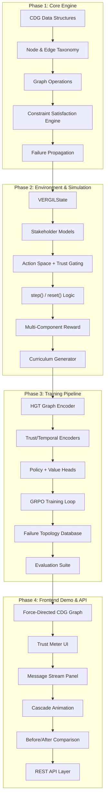

# VERGIL: Commitment Dependency Graph Engine — Full Implementation Plan

> Based on [VERGIL_System_Design.md](file:///Users/lakshbaweja/Programming/Virgil/VERGIL_System_Design.md) — **nothing removed, only additions allowed**.

## Architecture Overview



## Project Structure

```
Virgil/
├── VERGIL_System_Design.md          # Original design (untouched)
├── openenv.yaml                     # OpenEnv configuration
├── pyproject.toml                   # Python project config
├── requirements.txt
│
├── vergil/                          # Core Python package
│   ├── __init__.py
│   ├── core/                        # Phase 1: Core Engine
│   │   ├── __init__.py
│   │   ├── cdg.py                   # CommitmentGraph class
│   │   ├── nodes.py                 # Node taxonomy (EHC, ESC, IC, PC)
│   │   ├── edges.py                 # Edge taxonomy (T, R, TR, IE)
│   │   ├── constraints.py           # Temporal CSP solver
│   │   ├── cascade.py               # Failure propagation engine
│   │   └── types.py                 # Shared enums, dataclasses
│   │
│   ├── environment/                 # Phase 2: RL Environment
│   │   ├── __init__.py
│   │   ├── state.py                 # VERGILState dataclass
│   │   ├── actions.py               # ActionType, parameters, trust-gating
│   │   ├── stakeholders.py          # Stakeholder models & response functions
│   │   ├── reward.py                # Multi-component reward function
│   │   ├── vergil_env.py            # Main env: step(), reset()
│   │   ├── curriculum.py            # 4-stage curriculum + scenario generator
│   │   ├── messages.py              # Message generation & commitment extraction
│   │   └── time_manager.py          # Time advancement & deadline tracking
│   │
│   ├── training/                    # Phase 3: Training Pipeline
│   │   ├── __init__.py
│   │   ├── encoders/
│   │   │   ├── __init__.py
│   │   │   ├── hgt.py               # Heterogeneous Graph Transformer
│   │   │   ├── trust_encoder.py     # Trust MLP encoder
│   │   │   ├── temporal_encoder.py  # Positional temporal encoder
│   │   │   └── message_encoder.py   # Frozen LLM message encoder
│   │   ├── policy.py                # Policy + Value heads
│   │   ├── grpo.py                  # GRPO trainer with CDG modifications
│   │   ├── rollout.py               # Online rollout with CDG replay
│   │   ├── failure_db.py            # Failure Topology Database
│   │   └── evaluation.py            # Metrics suite
│   │
│   └── utils/
│       ├── __init__.py
│       ├── logging.py
│       └── serialization.py
│
├── frontend/                        # Phase 4: Demo Frontend
│   ├── index.html
│   ├── index.css
│   ├── src/
│   │   ├── main.js                  # App entry
│   │   ├── graph/
│   │   │   ├── force-graph.js       # D3 force-directed CDG visualization
│   │   │   ├── cascade-animation.js # Red pulse wave propagation
│   │   │   └── graph-renderer.js    # Node/edge rendering
│   │   ├── panels/
│   │   │   ├── trust-meters.js      # Per-stakeholder trust bars
│   │   │   ├── message-stream.js    # Real-time message panel
│   │   │   ├── decision-log.js      # Agent decision history
│   │   │   └── metrics-dashboard.js # Training metrics display
│   │   ├── comparison/
│   │   │   └── split-view.js        # Before/After training comparison
│   │   └── api/
│   │       └── client.js            # API client for backend
│   └── assets/
│       └── fonts/
│
├── api/                             # Phase 4: REST API
│   ├── __init__.py
│   ├── server.py                    # FastAPI server
│   ├── routes/
│   │   ├── cdg.py                   # CDG management endpoints
│   │   ├── commitment.py            # Commitment extraction API
│   │   ├── feasibility.py           # Feasibility evaluation API
│   │   └── demo.py                  # Demo/simulation endpoints
│   └── schemas.py                   # Pydantic models
│
├── tests/
│   ├── test_cdg.py
│   ├── test_constraints.py
│   ├── test_cascade.py
│   ├── test_environment.py
│   ├── test_reward.py
│   ├── test_stakeholders.py
│   └── test_curriculum.py
│
├── scenarios/                       # Pre-built scenario templates
│   ├── stage1_foundation.json
│   ├── stage2_complexity.json
│   ├── stage3_social.json
│   └── stage4_adversarial.json
│
└── scripts/
    ├── train.py                     # Training entry point
    ├── evaluate.py                  # Evaluation entry point
    └── demo.py                      # Demo runner
```

---

## Phase 1: Core Engine & Data Structures

> CDG graph, node/edge taxonomies, constraint satisfaction, failure propagation

### 1.1 — Shared Types & Enums

#### [NEW] [types.py](file:///Users/lakshbaweja/Programming/Virgil/vergil/core/types.py)

All enums and base dataclasses from the design doc:
- `CommitmentType` enum: `EHC`, `ESC`, `IC`, `PC` (Step 3 — By Explicitness)
- `ResourceType` enum: `TIME_BOUND`, `COGNITIVE_LOAD`, `DELIVERABLE`, `ATTENDANCE`, `SOCIAL` (Step 3 — By Resource Type)
- `EdgeType` enum: `TEMPORAL`, `RESOURCE_CONFLICT`, `TRUST_DEPENDENCY`, `IMPLICIT_EXTRACTION` (Step 3 — Edge Taxonomy)
- `ImplicitType` enum: `TRAVEL`, `BUFFER`, `RESOURCE`, `FOLLOWUP`
- `NodeStatus` enum: `PENDING`, `ACCEPTED`, `IN_PROGRESS`, `COMPLETED`, `AT_RISK`, `INFEASIBLE`, `FAILED`, `DECLINED`
- `FailureType` enum: `CASCADE`, `RESOURCE_CONFLICT`, `TRUST_COLLAPSE`, `DEADLINE_MISS`, `SILENT_DROP`
- `ActionType` enum: All 8 from Step 5 (`ACCEPT`, `DECLINE`, `COUNTER_PROPOSE`, `RENEGOTIATE`, `DEFER_DECISION`, `EXTRACT_CLARIFY`, `DELEGATE`, `DO_NOTHING`)
- `StakeholderType` enum: `BOSS`, `CLIENT`, `COLLEAGUE`, `FRIEND`, `CALENDAR_SYSTEM`, `EMAIL_SYSTEM`, `TASK_SYSTEM`
- Base dataclasses: `TimeSlot`, `Message`, `Commitment`, `Decision`, `RelationshipProfile`, `Event`

---

### 1.2 — Node Implementation

#### [NEW] [nodes.py](file:///Users/lakshbaweja/Programming/Virgil/vergil/core/nodes.py)

Full node taxonomy as defined in Step 3:

- `CommitmentNode` base class with fields:
  - `node_id: str`, `commitment_type: CommitmentType`, `resource_type: ResourceType`
  - `status: NodeStatus`, `stakeholder: str`, `created_at: datetime`
  - `urgency_score: float` (computed from deadline proximity)
  - `completion_probability: float`

- `ExplicitHardCommitment(CommitmentNode)` — `deadline: datetime`, `deliverable: str`, `hard_deadline: bool = True`
- `ExplicitSoftCommitment(CommitmentNode)` — `deadline_range: Tuple[datetime, datetime]`, `confidence: float`
- `ImplicitCommitment(CommitmentNode)` — `parent_commitment: str`, `implicit_type: ImplicitType`
- `PreconditionCommitment(CommitmentNode)` — `blocks: List[str]`, `required_by: datetime`

Each node computes `urgency_score` dynamically based on `(deadline - current_time)`.

---

### 1.3 — Edge Implementation

#### [NEW] [edges.py](file:///Users/lakshbaweja/Programming/Virgil/vergil/core/edges.py)

Full edge taxonomy from Step 3:

- `CDGEdge` base class: `source: str`, `target: str`, `edge_type: EdgeType`, `weight: float`
- `TemporalEdge(CDGEdge)` — `lag: timedelta`, `hard_ordering: bool`
- `ResourceConflictEdge(CDGEdge)` — `resource: ResourceType`, `conflict_severity: float` (bidirectional)
- `TrustDependencyEdge(CDGEdge)` — `stakeholder: str`, `trust_impact_positive: float`, `trust_impact_negative: float`
- `ImplicitExtractionEdge(CDGEdge)` — `extraction_confidence: float` (auto-generated by CDG engine)

---

### 1.4 — Commitment Dependency Graph

#### [NEW] [cdg.py](file:///Users/lakshbaweja/Programming/Virgil/vergil/core/cdg.py)

The core `CommitmentGraph` class, implementing all design doc properties:

- Built on `networkx.DiGraph` with heterogeneous node/edge support
- **DAG Constraint**: Cycle detection on T-edges and TR-edges; near-cycle (deadlock) detection and flagging
- **Dynamic Updates**: `add_node()`, `remove_node()`, `update_node_status()`, `add_edge()` — live mutations
- **Implicit Commitment Extraction**: `extract_implicit_commitments(explicit_node)` — generates IC nodes + IE-edges from known precondition patterns
- **Satisfiability Function**: `compute_satisfiability(current_time) -> float` — runs Temporal CSP to check if valid resource assignment exists
- **Graph Encoding**: `get_node_features()`, `get_edge_features()` — returns feature tensors for HGT consumption
- **Serialization**: `to_dict()`, `from_dict()` for persistence
- **Query Methods**: `get_active_nodes()`, `get_at_risk_nodes()`, `get_dependencies(node_id)`, `get_dependents(node_id)`, `get_conflicts(node_id)`

> [!IMPORTANT]
> The CDG is the heart of VERGIL. Every subsequent component reads from or writes to this graph. Its API must be rock-solid.

---

### 1.5 — Temporal CSP Solver

#### [NEW] [constraints.py](file:///Users/lakshbaweja/Programming/Virgil/vergil/core/constraints.py)

Implements the satisfiability evaluation from Step 3:

- `TemporalCSPSolver` class:
  - Takes a `CommitmentGraph` + `current_time` + `available_slots: List[TimeSlot]`
  - Checks: (1) All T-edges respected (ordering + lag), (2) No R-edges have overlap, (3) All deadlines met
  - Uses OR-Tools CP-SAT solver for constraint satisfaction
  - Returns: `SatisfiabilityResult(feasible: bool, score: float, violations: List[Violation], bottleneck_nodes: List[str])`
- `ResourceAllocator`: Assigns time blocks to nodes while respecting constraints
- `ConflictDetector`: Identifies R-edge overlaps and reports conflict severity

---

### 1.6 — Failure Propagation Engine

#### [NEW] [cascade.py](file:///Users/lakshbaweja/Programming/Virgil/vergil/core/cascade.py)

Implements the cascade propagation algorithm from Step 3 (the `propagate_failure` function):

```python
def propagate_failure(failed_node, cdg, trust_network) -> CascadeResult:
    """
    Recursive cascade propagation.
    Returns: list of affected nodes, cascade depth, trust impacts
    """
```

- `CascadeEvent` dataclass: `failed_node`, `affected_nodes`, `depth`, `trust_impacts`, `timestamp`
- `CascadeResult`: aggregated cascade events with `max_depth` metric
- Tracks cascade depth as a key metric (shallow = recoverable, deep = systemic failure)
- Opens renegotiation windows for affected nodes (2-step action window as specified)

---

### Phase 1 Deliverables

| Component | Test Coverage | Verification |
|---|---|---|
| Node taxonomy (all 4 types) | `test_nodes.py` | Unit tests for creation, urgency computation |
| Edge taxonomy (all 4 types) | `test_edges.py` | Unit tests for edge properties, bidirectionality |
| CommitmentGraph CRUD | `test_cdg.py` | Add/remove/query operations, cycle detection |
| Implicit extraction | `test_cdg.py` | Verify IC + IE-edge generation from explicit nodes |
| CSP solver | `test_constraints.py` | Known-feasible and known-infeasible scenarios |
| Cascade propagation | `test_cascade.py` | Single-node failure, multi-level cascade, trust updates |

---

## Phase 2: RL Environment & Simulation

> VERGILState, stakeholder models, action space with trust gating, reward system, curriculum

### 2.1 — VERGIL State

#### [NEW] [state.py](file:///Users/lakshbaweja/Programming/Virgil/vergil/environment/state.py)

Exact implementation of `VERGILState` from Step 4:

```python
@dataclass
class VERGILState:
    # All fields from Step 4 design doc
    cdg: CommitmentGraph
    cdg_embedding: Optional[Tensor]
    satisfiability_score: float
    current_time: datetime
    time_horizon: datetime
    workday_slots: List[TimeSlot]
    urgency_vector: List[float]
    cognitive_load: float        # 0.0–1.0
    energy_level: float
    buffer_time_remaining: float
    pending_messages: List[Message]
    extracted_commitments: List[Commitment]
    trust_scores: Dict[str, float]
    trust_history: Dict[str, List[Event]]
    relationship_metadata: Dict[str, RelationshipProfile]
    decision_log: List[Decision]
    renegotiation_count: Dict[str, int]
```

Hidden state (oracle-only):
```python
@dataclass
class HiddenState:
    _true_feasibility: bool
    _stakeholder_internal_state: Dict
    _future_messages: List[Message]
```

Observable vs Hidden matrix exactly as in Step 4 table.

---

### 2.2 — Stakeholder Models

#### [NEW] [stakeholders.py](file:///Users/lakshbaweja/Programming/Virgil/vergil/environment/stakeholders.py)

All 7 stakeholder types from Step 2:

**Tier 1:**
- `BossStakeholder` — latent urgency score (0-1), trust decay 3× faster than build, interprets silence as acceptance
- `ClientStakeholder` — binary cliff trust dynamics, scope creep behavior, escalation-prone

**Tier 2:**
- `ColleagueStakeholder` — reciprocal trust, CDG edge creation between agents, slow decay / fast repair
- `FriendStakeholder` — casual language masking, cancellation near-event 5× multiplier, guilt-based pressure

**Tier 3:**
- `CalendarSystem`, `EmailSystem`, `TaskSystem` — hard constraint providers

**Response Functions** `R_s(action, trust, context)`:
```python
trust_delta(Boss, broken_commitment) = -0.15 * (1 + deadline_proximity_factor)
trust_delta(Boss, proactive_renegotiation) = +0.08 * (lead_time_factor)
trust_delta(Friend, cancellation_day_of) = -0.35
trust_delta(Friend, cancellation_3_days_prior) = -0.08
```

**Personality Variation** (anti-overfitting from Step 8):
- Boss subtypes: `TYPE_A`, `COLLABORATIVE`, `ANXIOUS`
- Sampled per episode

**Behavior Patterns:**
- Boss: "quick asks" that are actually large, moves deadlines without notice
- Client: scope creep disguised as "small additions"
- Colleague: willing to renegotiate early, resentful if late
- Friend: guilt-based pressure, casual language masking real weight

---

### 2.3 — Action Space with Trust Gating

#### [NEW] [actions.py](file:///Users/lakshbaweja/Programming/Virgil/vergil/environment/actions.py)

All 8 action types from Step 5 with full parameter spaces:

- `Action` base: `action_type: ActionType`, `target_commitment: str`, `rationale: str`
- `AcceptAction` — straightforward CDG insertion
- `DeclineAction` — explanation text, alternative suggestion
- `CounterProposeAction` — `proposed_deadline`, `proposed_scope_reduction`, `proposed_resource_increase`, `confidence`
- `RenegotiateAction` — `existing_commitment_id`, `new_deadline`, `new_scope`, `trigger_reason`, `lead_time`
- `DeferDecisionAction` — `requested_time: timedelta`
- `ClarifyAction` — `questions: List[str]`
- `DelegateAction` — `delegate_to: str`, `justification: str`
- `DoNothingAction` — (risky: often implicit acceptance)

**Trust-Gated Action Availability** (Step 5 table):

| Action | Trust Threshold | Stakeholder |
|---|---|---|
| `propose_deadline_extension` | > 0.40 | Boss |
| `delegate` | > 0.55 | Client |
| `decline` | > 0.30 | Boss |
| `defer_decision` | > 0.50 | Any |

`is_action_available(action, trust_state, stakeholder) -> bool`

**Multi-Step Action Chains**: NEGOTIATE sequence tracking (Steps 1-4 as in design doc).

---

### 2.4 — Message System

#### [NEW] [messages.py](file:///Users/lakshbaweja/Programming/Virgil/vergil/environment/messages.py)

- `Message` dataclass: `sender`, `content`, `timestamp`, `tone_features`, `pressure_tactics`, `commitment_probability`
- `CommitmentExtractor`: Parses messages → structured `Commitment` objects
  - Handles commitment extraction ambiguity (Class 11 edge case)
  - Assigns `commitment_probability` score (0-1) for ambiguous messages
  - Extracts implicit commitment chains (Class 2 edge case)
- `MessageGenerator`: Creates realistic messages for simulation
  - Semantic paraphrasing (anti-overfitting)
  - Pressure tactic injection (Class 12 edge case)
  - Simultaneous message batches (Class 9 edge case)
- `MessageQueue`: Time-gated delivery system

---

### 2.5 — Time Management

#### [NEW] [time_manager.py](file:///Users/lakshbaweja/Programming/Virgil/vergil/environment/time_manager.py)

- `TimeManager`: Advances simulation time, delivers queued messages
- `DeadlineTracker`: Monitors deadline proximity, computes urgency vectors
- Handles time horizon variation (3-day sprints to 3-month arcs, from Step 8)
- Force majeure event injection (Class 10 edge case)

---

### 2.6 — Multi-Component Reward Function

#### [NEW] [reward.py](file:///Users/lakshbaweja/Programming/Virgil/vergil/environment/reward.py)

Exact implementation of Step 7:

```python
R_total = w₁ × R_fulfill + w₂ × R_trust + w₃ × R_proactive + w₄ × R_accuracy
        - p₁ × P_broken - p₂ × P_overrefusal - p₃ × P_silent_drop
```

**Weights**: `w₁=0.35, w₂=0.25, w₃=0.20, w₄=0.10, p₁=0.40, p₂=0.30, p₃=0.50`

Each component class:
- `FulfillmentReward` — with `quality_modifier ∈ [0.6, 1.2]` and `timeliness_modifier = exp(-delay_hours/24)`
- `TrustReward` — weighted by relationship: Boss=0.35, Client=0.30, Colleague=0.20, Friend=0.15
- `ProactiveRenegotiationReward` — `lead_time_bonus = max(0, 1 - (hours_to_deadline/48)²)` × resolution quality
- `AccuracyReward` — `1 - |predicted_feasibility - actual_feasibility|`
- `BrokenCommitmentPenalty` — `base × trust_weight × (1 + cascade_depth) × (1 + deadline_proximity)` — low trust = MORE costly
- `OverRefusalPenalty` — activates when decline rate > 40% of feasible commitments
- `SilentDropPenalty` — grows over time: `0.5 × (1 + hours_without_renegotiation/24)` — **largest penalty**

**Delayed Reward Handling:**
- Immediate signals: trust deltas, renegotiation quality, extraction accuracy
- Deferred episode-end signals: CDG satisfiability rate, trust trajectory, cascade frequency
- TD(λ) with λ=0.9 for credit assignment
- Advantage function shaping: `R_shaped = R + γ × Φ(s') - Φ(s)` where `Φ(s) = satisfiability_score(CDG)`

**Anti-hack mechanisms:**
- "Decline Everything" → `over_refusal_penalty` + trust decay with all stakeholders
- "Accept Everything" → `under_delivery_penalty = 0.5 × broken × (1 + cascade_depth)` + rapid trust collapse
- "Always Predict Feasible" → accuracy penalty when things fail
- "Always Predict Infeasible" → over-refusal penalty

---

### 2.7 — Main Environment

#### [NEW] [vergil_env.py](file:///Users/lakshbaweja/Programming/Virgil/vergil/environment/vergil_env.py)

The OpenEnv-compatible environment class with exact `step()` and `reset()` logic from Step 9:

**`step(action) -> (state, reward, done, info)`:**
1. Validate action given current trust state (trust-gating)
2. Execute action on CDG
3. Simulate stakeholder response
4. Update trust network
5. Advance time; deliver queued messages
6. Check deadline violations; propagate cascades
7. Compute intermediate reward
8. Update CDG satisfiability
9. Check terminal condition
10. If terminal, add episode-end reward components

**`reset(force_curriculum_stage=None) -> state`:**
1. Generate scenario from curriculum (FTD-biased)
2. Build initial CDG with seed commitments
3. Initialize trust (randomized ∼ N(0.65, 0.1), clipped [0.3, 0.9])
4. Set up time-gated message queue
5. Return initial state

**Terminal conditions:** All commitments resolved, trust collapse across all stakeholders, max steps reached, or CDG becomes fully infeasible.

---

### 2.8 — Curriculum Generator

#### [NEW] [curriculum.py](file:///Users/lakshbaweja/Programming/Virgil/vergil/environment/curriculum.py)

Exact 4-stage curriculum from Step 8:

| Stage | Episodes | CDG Size | Stakeholders | Features |
|---|---|---|---|---|
| 1 Foundation | 1–50 | 2–3 nodes | 1–2 | No implicit; deterministic |
| 2 Complexity | 50–200 | 4–6 nodes | 3–4 | Simple implicit; stochastic flex |
| 3 Social | 200–500 | 6–10 nodes | All types | Full implicit chains; trust-gated |
| 4 Adversarial | 500+ | 10–15 nodes | Multi-agent | Manipulation; force majeure |

**Promotion criterion**: `rolling_avg_reward > threshold`

**Scenario generation** (60/30/10 split from Step 8):
```python
def generate_episode(ftd, curriculum_stage):
    # 60%: Targeted at top-5 failure patterns
    # 30%: Random stage-appropriate complexity
    # 10%: Deliberately easy (prevent catastrophic forgetting)
```

**Anti-overfitting mechanisms:**
- Semantic paraphrasing of same commitments
- Stakeholder personality variation per episode
- Time horizon variation (3 days to 3 months)
- Domain rotation (work, personal, hybrid)

---

### 2.9 — Scenario Templates

#### [NEW] Scenario JSON files

Pre-built scenarios for each curriculum stage, covering all 12 edge cases from Step 6:

| Edge Case | Scenario File | Stage |
|---|---|---|
| Class 1: Individually feasible but collectively infeasible | `stage2_complexity.json` | 2 |
| Class 2: Hidden implicit chains | `stage2_complexity.json` | 2 |
| Class 3: Conflicting loyalties | `stage3_social.json` | 3 |
| Class 4: Trust collapse cascades | `stage3_social.json` | 3 |
| Class 5: "Decline Everything" hack | All stages | 1+ |
| Class 6: "Accept Everything" hack | All stages | 1+ |
| Class 7: Delayed failure attribution | `stage3_social.json` | 3 |
| Class 8: Resource misestimation | `stage2_complexity.json` | 2 |
| Class 9: Simultaneous infeasibility | `stage4_adversarial.json` | 4 |
| Class 10: External interruptions | `stage4_adversarial.json` | 4 |
| Class 11: Commitment extraction ambiguity | `stage3_social.json` | 3 |
| Class 12: Social manipulation patterns | `stage4_adversarial.json` | 4 |

---

### Phase 2 Deliverables

| Component | Test Coverage | Verification |
|---|---|---|
| VERGILState creation & updates | `test_environment.py` | State consistency after transitions |
| All stakeholder response functions | `test_stakeholders.py` | Trust delta computations match design doc |
| Trust-gated action availability | `test_actions.py` | Actions locked/unlocked at correct thresholds |
| Multi-component reward | `test_reward.py` | Each component matches formula; anti-hack triggers |
| step() full pipeline | `test_environment.py` | 10-step scenario with known optimal outcome |
| reset() with curriculum | `test_curriculum.py` | Correct stage progression, scenario distribution |

---

## Phase 3: Training Pipeline

> Model architecture, GRPO training, failure topology tracking, evaluation

### 3.1 — Heterogeneous Graph Transformer

#### [NEW] [hgt.py](file:///Users/lakshbaweja/Programming/Virgil/vergil/training/encoders/hgt.py)

From Step 10 model architecture:
- Input: CDG heterogeneous graph (4 node types × 4 edge types)
- Node features: `[commitment_type, deadline_proximity, resource_requirements, stakeholder_id, completion_probability]`
- Edge features: `[edge_type, weight, temporal_lag, conflict_severity]`
- Architecture: Multi-head attention over heterogeneous neighbors
- Output: 512-dim CDG embedding (per-node embeddings + graph-level pooled embedding)
- Built with PyTorch Geometric's `HGTConv`

---

### 3.2 — Supporting Encoders

#### [NEW] [trust_encoder.py](file:///Users/lakshbaweja/Programming/Virgil/vergil/training/encoders/trust_encoder.py)
- MLP: `trust_vector → 64-dim trust embedding`
- Includes trust history features (non-Markovian signal)

#### [NEW] [temporal_encoder.py](file:///Users/lakshbaweja/Programming/Virgil/vergil/training/encoders/temporal_encoder.py)
- Positional encoding: `time_features → 32-dim time embedding`
- Encodes: current time, time-to-deadline per node, workday structure

#### [NEW] [message_encoder.py](file:///Users/lakshbaweja/Programming/Virgil/vergil/training/encoders/message_encoder.py)
- Frozen LLM (Qwen2.5-7B or smaller distilled): `pending_messages → 256-dim message embedding`
- Extracts tone features, urgency signals, commitment structure

---

### 3.3 — Policy & Value Heads

#### [NEW] [policy.py](file:///Users/lakshbaweja/Programming/Virgil/vergil/training/policy.py)

From Step 10:
```
Fusion: Concat(CDG_512, trust_64, time_32, message_256) → 864-dim
Policy Head: MLP(864 → 256 → action_dim)
Value Head: MLP(864 → 256 → 1)
```

- Action masking based on trust-gated availability
- Outputs structured action type + parameters
- Base LLM: Qwen2.5-7B-Instruct with LoRA (r=32) via Unsloth

---

### 3.4 — GRPO Trainer

#### [NEW] [grpo.py](file:///Users/lakshbaweja/Programming/Virgil/vergil/training/grpo.py)

From Step 10 — GRPO with CDG-specific modifications:

**Training config:**
```python
{
    "model": "qwen2.5-7b-instruct",
    "method": "grpo",
    "reward_model": "vergil_multi_component_reward",
    "group_size": 8,
    "max_steps": 80,
    "gradient_accumulation": 4,
    "lora_r": 32,
    "learning_rate": 2e-5,
    "use_unsloth": True,
    "flash_attention": True
}
```

**Commitment Group Sampling**: Sample *decision sequences* grouped by CDG topology, not individual actions.

---

### 3.5 — Rollout Engine

#### [NEW] [rollout.py](file:///Users/lakshbaweja/Programming/Virgil/vergil/training/rollout.py)

Online rollout with CDG replay:
1. Sample CDG topology from curriculum
2. Run N=8 parallel rollouts with same topology, different stakeholder personalities
3. Compute group-relative advantages across 8 rollouts
4. Store `(topology, best_decision_sequence)` in replay buffer for distillation

---

### 3.6 — Failure Topology Database

#### [NEW] [failure_db.py](file:///Users/lakshbaweja/Programming/Virgil/vergil/training/failure_db.py)

From Step 8:
```python
@dataclass
class FailurePattern:
    graph_signature: str           # Hash of CDG topology at failure
    failure_type: FailureType
    episode_id: str
    step_at_failure: int
    agent_decision_sequence: List[Action]
    counterfactual_optimal: List[Action]  # Computed by oracle
    frequency: int
```

- `FailureTopologyDatabase`: Stores, queries, and frequency-weights failure patterns
- Feeds into curriculum generator (60% targeted scenario generation)

---

### 3.7 — Evaluation Suite

#### [NEW] [evaluation.py](file:///Users/lakshbaweja/Programming/Virgil/vergil/training/evaluation.py)

All 6 metrics from Step 10:

| Metric | Target |
|---|---|
| Commitment Fulfillment Rate | > 0.85 |
| Trust Stability Index (σ of trajectory) | < 0.12 |
| Proactive Renegotiation Rate | > 0.60 |
| Cascade Prevention Rate | > 0.70 |
| Feasibility Calibration ECE | < 0.08 |
| Over-Refusal Rate | < 0.15 |

---

## Phase 4: Frontend Demo & REST API

> Interactive visualization, cascade animation, before/after comparison, API endpoints

### 4.1 — Design System & Theme

#### [NEW] [index.css](file:///Users/lakshbaweja/Programming/Virgil/frontend/index.css)

Premium dark-mode design system:
- **Color palette from Step 12:**
  - Fulfilled: `#4ade80` (green)
  - At-Risk: `#fbbf24` (amber)
  - Broken/Infeasible: `#f87171` (red)
  - Pending: `#60a5fa` (blue)
  - Implicit/Ghost: `#9ca3af` (grey)
- Background: deep dark gradient (`#0a0a0f` → `#1a1a2e`)
- Glassmorphism panels with frosted glass effect
- Typography: Inter / JetBrains Mono
- Smooth micro-animations on all interactions
- CSS custom properties for full theming

---

### 4.2 — Force-Directed CDG Visualization

#### [NEW] [force-graph.js](file:///Users/lakshbaweja/Programming/Virgil/frontend/src/graph/force-graph.js)

Using D3.js force simulation:
- **Nodes** rendered as circles with color-coded status (Step 12 colors)
- **Edges**: Solid directed lines for T-edges, dashed for R-edges, animated pulse for active cascades
- Interactive: hover for node details, click to inspect commitment, drag to rearrange
- Real-time updates as the CDG changes during simulation
- Smooth transitions when nodes change status

#### [NEW] [cascade-animation.js](file:///Users/lakshbaweja/Programming/Virgil/frontend/src/graph/cascade-animation.js)

From Step 12 — the keynote demo feature:
- Red pulse wave propagating along T-edges when a node fails
- Each dependent node flashes, then color-shifts based on new risk assessment
- Speed and intensity proportional to cascade severity
- **"Makes the cause-effect relationship visceral for demo audiences"**

---

### 4.3 — Trust Meters Panel

#### [NEW] [trust-meters.js](file:///Users/lakshbaweja/Programming/Virgil/frontend/src/panels/trust-meters.js)

From Step 12:
- Per-stakeholder horizontal trust bars
- Color gradient: Green (>0.7) → Yellow (0.4-0.7) → Red (<0.4)
- Delta indicators: `+/-` change since last step with animated transitions
- Lock icons appear on actions when trust < threshold
- Stakeholder avatar/icon + name + role

---

### 4.4 — Message Stream Panel

#### [NEW] [message-stream.js](file:///Users/lakshbaweja/Programming/Virgil/frontend/src/panels/message-stream.js)

From Step 12:
- Real-time message arrival with typing animation
- Commitment extraction overlay (highlighting extracted obligations in the text)
- Implicit commitment inference display ("Detected implicit: travel buffer 30min")
- Feasibility check result badge per commitment
- Sender avatar + timestamp + tone indicator

---

### 4.5 — Before/After Training Comparison

#### [NEW] [split-view.js](file:///Users/lakshbaweja/Programming/Virgil/frontend/src/comparison/split-view.js)

From Step 12:
- Split screen layout
- Left: Untrained agent — accepts everything → CDG turns red → cascade animation fires
- Right: VERGIL-trained agent — counter-proposes, renegotiates → CDG stays green
- Synchronized playback: same messages sent to both simultaneously
- Step-by-step controls: play, pause, step forward, speed control

---

### 4.6 — Metrics Dashboard

#### [NEW] [metrics-dashboard.js](file:///Users/lakshbaweja/Programming/Virgil/frontend/src/panels/metrics-dashboard.js)

- Real-time charts for all 6 evaluation metrics
- Training progress curves (reward over episodes)
- Curriculum stage indicator with promotion criteria progress
- Failure pattern frequency heatmap

---

### 4.7 — REST API

#### [NEW] [server.py](file:///Users/lakshbaweja/Programming/Virgil/api/server.py)

FastAPI server implementing the Layer 1 API from Step 13:

**CDG Management endpoints:**
- `POST /api/cdg/create` — Create new CDG
- `GET /api/cdg/{id}` — Get CDG state
- `POST /api/cdg/{id}/node` — Add commitment node
- `DELETE /api/cdg/{id}/node/{node_id}` — Remove node

**Commitment Extraction API:**
- `POST /api/commitment/extract` — Given email/message text → structured CDG nodes

**Feasibility Evaluation API:**
- `POST /api/feasibility/check` — Given new commitment + CDG → accept/decline/counter recommendation

**Demo/Simulation endpoints:**
- `POST /api/demo/start` — Start demo simulation
- `POST /api/demo/step` — Execute one step
- `GET /api/demo/state` — Get current demo state
- `WebSocket /ws/demo` — Real-time state streaming for frontend

---

### 4.8 — OpenEnv Configuration

#### [NEW] [openenv.yaml](file:///Users/lakshbaweja/Programming/Virgil/openenv.yaml)

Exact schema from Step 9:
```yaml
name: vergil-cdg-engine
version: 1.2.0
description: Commitment Dependency Graph training environment
theme: [long-horizon-planning, personalized-assistants, self-improving]
environment:
  type: text-based-agentic
  observability: partial
  horizon: variable  # 15-80 steps
  reset_mode: curriculum
# ... full config as in design doc
```

---

## Execution Order

> [!IMPORTANT]
> Each phase must be **fully tested** before moving to the next. No skipping.

```mermaid
gantt
    title VERGIL Implementation Phases
    dateFormat X
    axisFormat %s

    section Phase 1
    types.py & enums           :a1, 0, 1
    nodes.py                   :a2, after a1, 1
    edges.py                   :a3, after a1, 1
    cdg.py                     :a4, after a2, 2
    constraints.py             :a5, after a4, 2
    cascade.py                 :a6, after a5, 1
    Phase 1 Tests              :a7, after a6, 1

    section Phase 2
    state.py                   :b1, after a7, 1
    stakeholders.py            :b2, after b1, 2
    actions.py                 :b3, after b1, 1
    messages.py                :b4, after b2, 1
    time_manager.py            :b5, after b3, 1
    reward.py                  :b6, after b4, 2
    vergil_env.py              :b7, after b6, 2
    curriculum.py + scenarios  :b8, after b7, 2
    Phase 2 Tests              :b9, after b8, 1

    section Phase 3
    HGT encoder               :c1, after b9, 2
    Supporting encoders        :c2, after c1, 1
    Policy + Value heads       :c3, after c2, 1
    GRPO trainer               :c4, after c3, 2
    Rollout engine             :c5, after c4, 1
    Failure DB                 :c6, after c5, 1
    Evaluation suite           :c7, after c6, 1

    section Phase 4
    Design system (CSS)        :d1, after c7, 1
    Force graph + cascade      :d2, after d1, 2
    Trust meters + messages    :d3, after d2, 1
    Split view comparison      :d4, after d3, 1
    Metrics dashboard          :d5, after d4, 1
    REST API + WebSocket       :d6, after d1, 2
    Integration testing        :d7, after d6, 1
```



---

## Verification Plan

### Automated Tests
```bash
# Phase 1
pytest tests/test_cdg.py tests/test_constraints.py tests/test_cascade.py -v

# Phase 2
pytest tests/test_environment.py tests/test_reward.py tests/test_stakeholders.py tests/test_curriculum.py -v

# Phase 3
python scripts/evaluate.py --stage 1 --episodes 10  # Smoke test

# Phase 4
python api/server.py &  # Start API
# Browser-based demo verification
```

### Manual Verification
- Run 50-episode training on Stage 1 to verify reward convergence
- Visual verification of cascade animation in frontend
- Before/after comparison with known scenario
- API response validation against design doc schemas

---

## Open Questions

> [!WARNING]
> **GPU Requirements**: The training pipeline (Phase 3) requires a GPU with ≥16GB VRAM for Qwen2.5-7B with LoRA. Should we include a smaller model fallback (e.g., Qwen2.5-1.5B) for local development?

> [!IMPORTANT]
> **Frontend Framework Choice**: The design doc doesn't specify a framework for the frontend. Given the complexity of the CDG visualization (D3.js force graph, real-time WebSocket updates, cascade animations), I propose building it as a **vanilla HTML/CSS/JS application** with D3.js — no React/Vite overhead. This keeps phase 4 fast. Do you agree, or would you prefer a framework?

> [!NOTE]
> **OR-Tools vs Custom CSP**: The constraint solver (Phase 1) can use Google OR-Tools CP-SAT (production-grade) or a simpler custom solver. OR-Tools is more powerful but adds a dependency. I recommend OR-Tools for accuracy. Acceptable?
